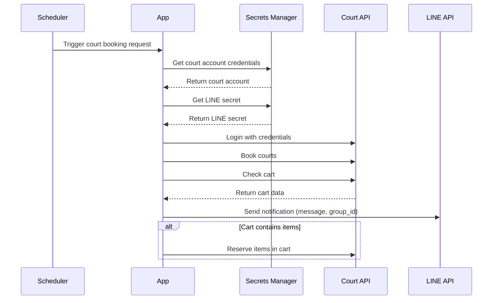

# Badminton Bot

Automates badminton court booking via third-party APIs and LINE notifications.

---

## How it Works

1. Use the third-party API to log in, and explicitly set the User-Agent header to help prevent the website from
   detecting the script as a bot.
2. Fetch available slots and attempt to reserve them by adding to the cart.
3. Continuously retry the reservation process to secure the slots as early as possible.
4. Send the notification to LINE group
5. Monitor the cart after adding items — if any items are removed by the admin, attempt to re-add them automatically.

---

### Booking Flow Sequence Diagram



---

## Architecture


---

### Event Bridge

Define scheduled events to automatically trigger the lambda function when the reservation is available

Sample event:

```
{
     "accountId": "1",
     "location": "queensbridge-sports-community-centre",
     "activity": "badminton-40min",
     "keyword": "Court 1,Court 3",
     "day_offset": 7,
     "slots": [
         {
             "start_time": "11:00",
             "end_time": "11:40"
         },
         {
             "start_time": "11:40",
             "end_time": "12:20"
         }
     ]
 }
```

---

### Secret Manager

Store the account details (username, password), and allow the lambda function to fetch them by account ID

---

## UI - LINE Notifications

Integrated LINE API to send the flex message to target group

