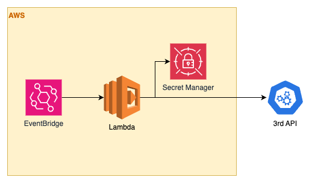

# Badminton Bot

The application is used to book the badminton court

## How it works?

1. Use the third-party API to log in, and explicitly set the User-Agent header to help prevent the website from detecting the script as a bot.
2. Fetch available slots and attempt to reserve them by adding to the cart.
3. Continuously retry the reservation process to secure the slots as early as possible.
4. Monitor the cart after adding items — if any items are removed by the admin, attempt to re-add them automatically.

## Architecture

